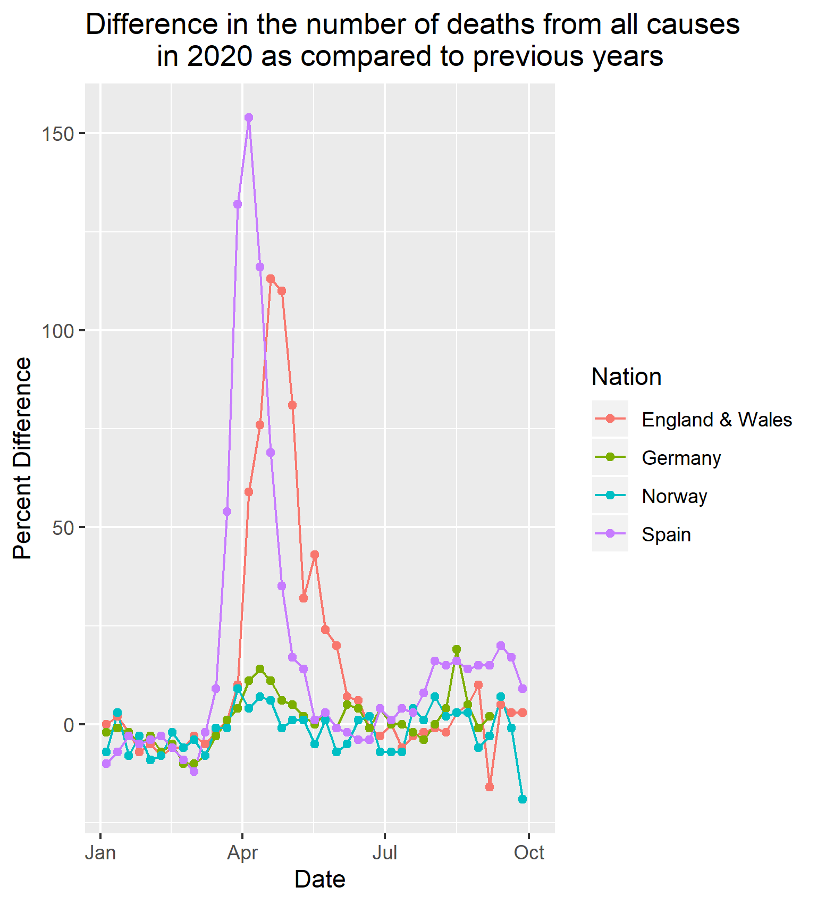
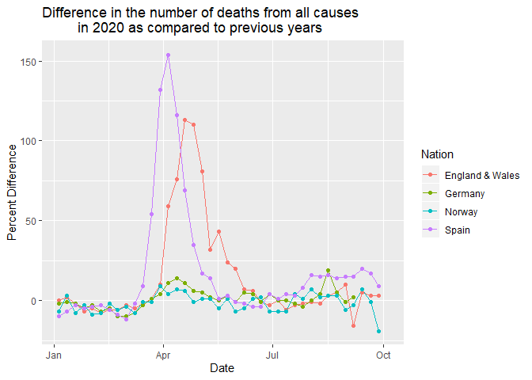
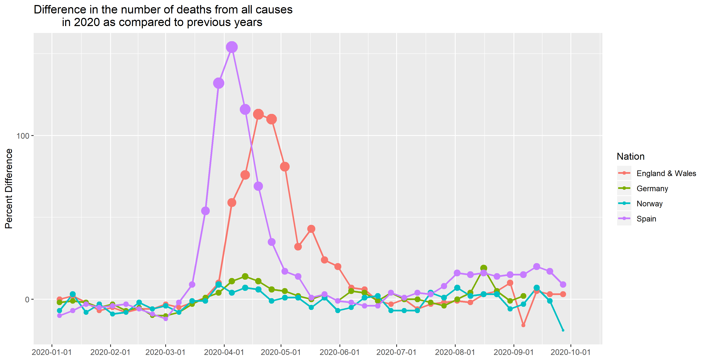
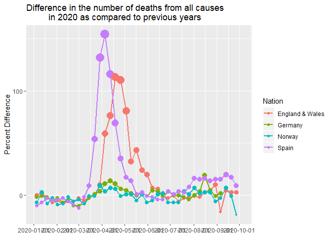
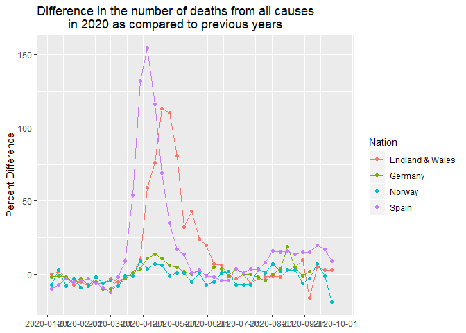
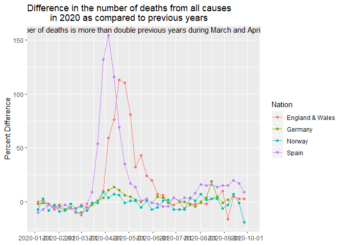
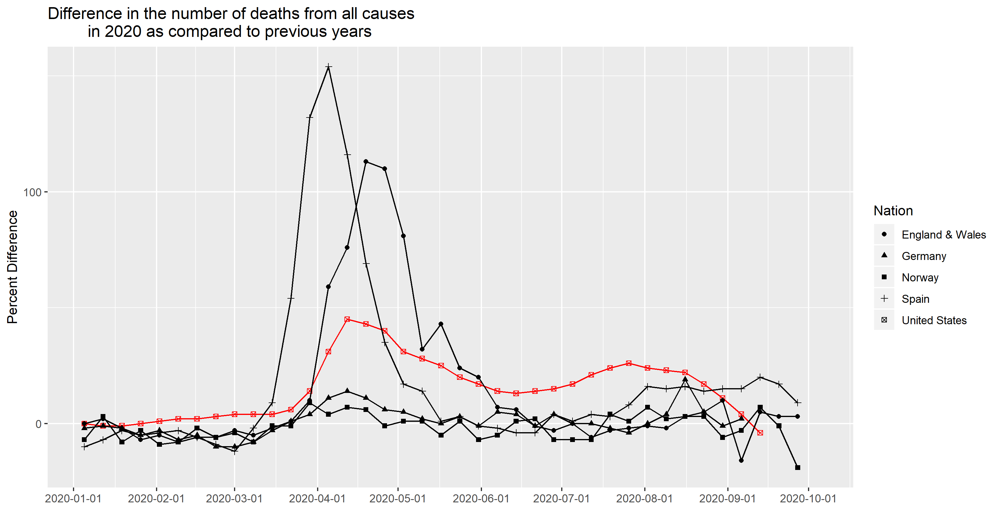
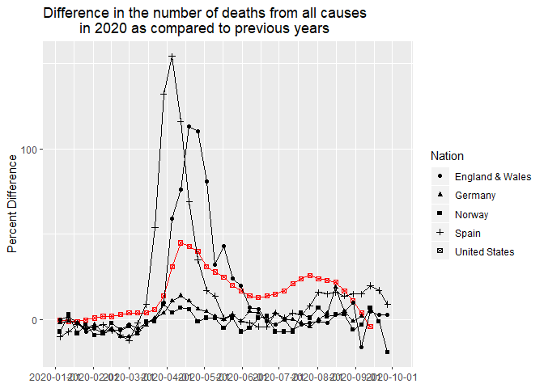
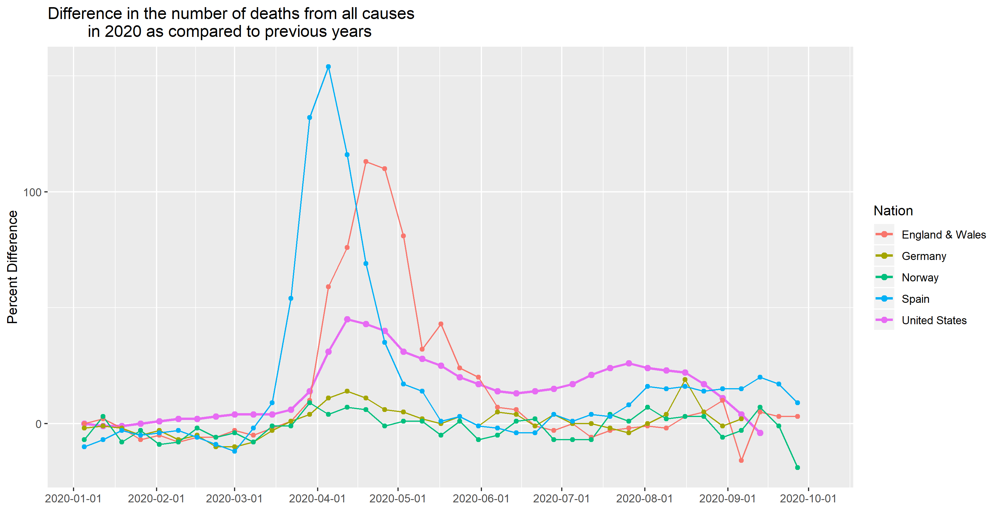
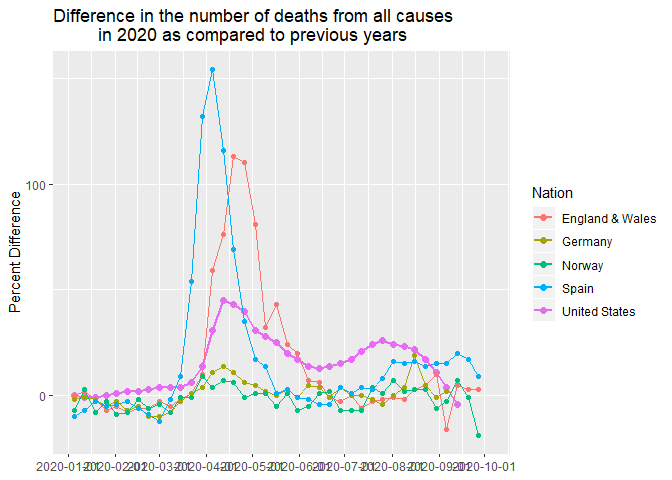

1
=

    covidLong %>% 
      filter(Nation %in% c("Spain","England & Wales","Germany","Norway")) %>% 
      ggplot(aes(x=date, y=p_score, group = Nation, color = Nation))+
        geom_line()+
        geom_point()+
        labs(x="Date", y="Percent Difference",
             title = "Difference in the number of deaths from all causes 
             in 2020 as compared to previous years")

2
=

This graph uses the size functionality to highlight the data. The size
is tied to a points y positioning. In this case, it draws attention up
on the graph to an area that has less going on. If the data were more
similar, it would be harder for the size difference to stand out.

    covidLong %>% 
      filter(Nation %in% c("Spain","England & Wales","Germany","Norway")) %>% 
      ggplot(aes(x=date, y=p_score, group = Nation, color = Nation))+
      geom_line(size = 1)+
      geom_point(aes(size = p_score), legend = FALSE)+
      labs(x="Date", y="Percent Difference",
           title = "Difference in the number of deaths from all causes 
             in 2020 as compared to previous years")+
      scale_x_date(NULL, breaks = breaks_width(width = "1 month"))+
      scale_y_continuous(breaks = seq(0,150, by=100))+
      guides(size = FALSE)

3
=

This graph uses the geom\_hline() function to highlight the data over
100. By drawing a distinct line at y =100, it shows that there is
something that the viewer needs to pay attention to, either above or
below it. One drawback to this approach is that its not always clear
which side of the line needs to have your attention and may direct the
viewer away from the data you want to show.

    covidLong %>% 
      filter(Nation %in% c("Spain","England & Wales","Germany","Norway")) %>% 
      ggplot(aes(x=date, y=p_score, group = Nation, color = Nation))+
      geom_line()+
      geom_point()+
      geom_hline(yintercept = 100,color="red")+
      labs(x="Date", y="Percent Difference",
           title = "Difference in the number of deaths from all causes 
             in 2020 as compared to previous years")+
      scale_x_date(NULL, breaks = breaks_width(width = "1 month"))

4
=

This second one uses geom\_text. The text is positioned over the peaks
of the data. Having text near the data can help draw attention to an
area because it might be unusual on a graph. This approach wouldn’t work
well if there are already other labels or annotations on the graph,
sometimes making it too cluttered.

    over100Text <- tibble(
      date=as.Date('2020-5-1', tryFormats = c("%Y-%m-%d", "%Y/%m/%d")),
      p_score = Inf,
      Nation = "",
      label = "The number of deaths is more than double previous years during March and April",
    )

    covidLong %>% 
      filter(Nation %in% c("Spain","England & Wales","Germany","Norway")) %>% 
      ggplot(aes(x=date, y=p_score, group = Nation, color = Nation))+
      geom_line()+
      geom_point()+
      geom_text(data = over100Text,mapping = aes(label = label), vjust = "top", hjust = "center", color = "black")+
      labs(x="Date", y="Percent Difference",
           title = "Difference in the number of deaths from all causes 
             in 2020 as compared to previous years")+
      scale_x_date(NULL, breaks = breaks_width(width = "1 month"))

5
=

I decided to use color to show the US. In order to make sure the US was
the only one with color, I used shapes to distinguish the remainder of
them. This method works well for interactive graphs and for making one
thing stand out, but it fails if there are too many groups represented
on the graph. Even with shapes, they could blend together no one can
tell whats going on.

    #with USA
    covidUSA <- covidLong %>% 
      filter(Nation == "United States")

    #1
    covidLong %>% 
      filter(Nation %in% c("Spain","England & Wales","Germany","Norway")) %>% 
      ggplot(aes(x=date, y=p_score, group = Nation, shape = Nation))+
      geom_line(data = covidUSA,aes(x=date, y=p_score), color = "red")+
      geom_point(data = covidUSA,aes(x=date, y=p_score), color = "red")+
      geom_line()+
      geom_point()+
      labs(x="Date", y="Percent Difference",
           title = "Difference in the number of deaths from all causes 
             in 2020 as compared to previous years")+
      scale_x_date(NULL, breaks = breaks_width(width = "1 month"))+
      scale_y_continuous(breaks = seq(0,150, by=100))

6
=

I used the size on this one to separate the US from the others. Its much
more subtle than my other graph, but its easier to tell what is going on
with the other nations on the graph while still highlighting what I want
the viewer to see.

    covidLong %>% 
      filter(Nation %in% c("Spain","England & Wales","Germany","Norway")) %>% 
      ggplot(aes(x=date, y=p_score, group = Nation, color = Nation))+
      geom_line(data = covidUSA,aes(x=date, y=p_score), size = 1)+
      geom_point(data = covidUSA,aes(x=date, y=p_score), size = 2)+
      geom_line()+
      geom_point()+
      labs(x="Date", y="Percent Difference",
           title = "Difference in the number of deaths from all causes 
             in 2020 as compared to previous years")+
      scale_x_date(NULL, breaks = breaks_width(width = "1 month"))+
      scale_y_continuous(breaks = seq(0,150, by=100))

